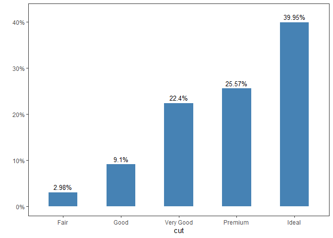

<!-- README.md is generated from README.Rmd. Please edit that file -->

# package 

<!-- badges: start -->

[](https://github.com/sostenes767/package/actions/workflows/R-CMD-check.yaml)
[](https://app.codecov.io/gh/sostenes767/package?branch=master)

[](https://orcid.org/0000-0002-5981-4266)

<!-- badges: end -->

O objetivo do package é construir um pacote simples com algumas funções
uteis.

## Installation

You can install the development version of package from
[GitHub](https://github.com/) with:

``` r
# install.packages("devtools")
devtools::install_github("sostenes767/package")
```

## Example

This is a basic example which shows you how to solve a common problem:

``` r
library(package)
#> 
#> Attaching package: 'package'
#> The following object is masked from 'package:datasets':
#> 
#>     mtcars
## Básicos exemplos do pacote

#Função somar
somar(10,2)
#> [1] 12

#Função multiplicar
multiplicar(10,2)
#> [1] 20

#Função subtrair
subtrair(5,2)
#> [1] 3

#Função dividir
dividir(10,2)
#> [1] 5
```

## Gráfico de barras

``` r
#Grafico de barra simples
graf_bar(ggplot2::diamonds$cut, xlab = "cut")
```


